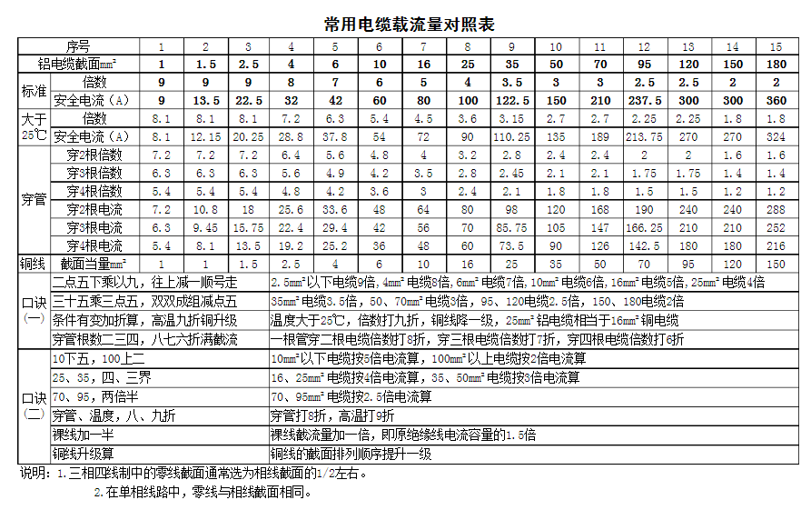

.. _电力相关记录.rst:

=======================================
电力相关记录
=======================================

　　二。 各种家用电器的功率因数

　　有人测试了各种家用电器的功耗和功率因数，其结果如下：

+------+----------+---------------+----------+-----------------+----------------+
| 序号 | 名称     | 设备容量（W） | 功率因数 | 无功功率（var） | 视在功率（VA） |
+======+==========+===============+==========+=================+================+
| 1    | 照明     | 200           | 0.90     | 96.86           | 222.22         |
+------+----------+---------------+----------+-----------------+----------------+
| 2    | 空调     | 3000          | 0.80     | 2250.00         | 3750.00        |
+------+----------+---------------+----------+-----------------+----------------+
| 3    | 电冰箱   | 150           | 0.60     | 200.00          | 250.00         |
+------+----------+---------------+----------+-----------------+----------------+
| 4    | 微波炉   | 1000          | 0.90     | 484.32          | 1111.11        |
+------+----------+---------------+----------+-----------------+----------------+
| 5    | 电热水器 | 2000          | 1.00     | 0.00            | 2000.00        |
+------+----------+---------------+----------+-----------------+----------------+
| 6    | 电饭煲   | 1000          | 1.00     | 0.00            | 1000.00        |
+------+----------+---------------+----------+-----------------+----------------+
| 7    | 计算机   | 300           | 0.80     | 225.00          | 375.00         |
+------+----------+---------------+----------+-----------------+----------------+
| 8    | 打印机   | 250           | 0.80     | 187.50          | 312.50         |
+------+----------+---------------+----------+-----------------+----------------+
| 9    | 电视机   | 200           | 0.80     | 150.00          | 250.00         |
+------+----------+---------------+----------+-----------------+----------------+
| 10   | 洗衣机   | 200           | 0.60     | 266.67          | 333.33         |
+------+----------+---------------+----------+-----------------+----------------+
| 11   | 抽油烟机 | 50            | 0. 80    | 37.50           | 62.50          |
+------+----------+---------------+----------+-----------------+----------------+
| 12   | 音响     | 300           | 0.60     | 400.00          | 500.00         |
+------+----------+---------------+----------+-----------------+----------------+
| 13   | 饮水机   | 600           | 1.00     | 0.00            | 600.00         |
+------+----------+---------------+----------+-----------------+----------------+
| 14   | 卫生设备 | 1000          | 1.00     | 0.00            | 1000.00        |
+------+----------+---------------+----------+-----------------+----------------+
| 15   | 保健设备 | 600           | 0.80     | 450.00          | 750.00         |
+------+----------+---------------+----------+-----------------+----------------+
| 16   | 录象机   | 200           | 0.90     | 96.86           | 222.22         |
+------+----------+---------------+----------+-----------------+----------------+
| 17   | DVD\VCD  | 100           | 0.90     | 48.43           | 111.11         |
+------+----------+---------------+----------+-----------------+----------------+

5看

看市场

看友商

看业界

看自己

.. mermaid::

   sequenceDiagram
      participant Alice
      participant Bob
      Alice->John: Hello John, how are you?
      loop Healthcheck
          John->John: Fight against hypochondria
      end
      Note right of John: Rational thoughts  prevail...
      John-->Alice: Great!
      John->Bob: How about you?
      Bob-->John: Jolly good!
