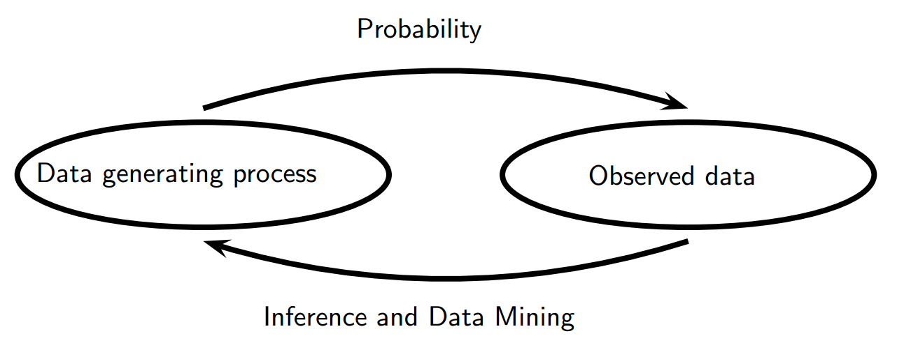

.. _统计理论.rst:

=======================================
统计理论 All of statistics学习笔记
=======================================

--------------------------
前言
--------------------------

第一部分概率论：不确定性，统计推断的基础

    给一个数据生成的过程，结果的属性是什么？

第二部分统计推断和他的近亲，数据挖掘和机器学习

    给出数据的结果，我们能说数据生成的过程是怎么样的？

预测，分类，聚类，估计是统计推断。数据分析，机器学习和数据挖掘是统计推断的应用

统计、数据挖掘对应含义字典

+------------------------+------------+-----------------------------------------+
| 统计                   | 计算机科学 | 含义                                    |
+========================+============+=========================================+
| 估计                   | 学习       | 使用数据去估计未知的属性                |
+------------------------+------------+-----------------------------------------+
| 分类                   | 监督学习   | 通过X预测离散的Y                        |
+------------------------+------------+-----------------------------------------+
| 聚类                   | 非监督学习 | 把数据分组                              |
+------------------------+------------+-----------------------------------------+
| 数据                   | 训练样本   | :math:`(X_{1},X_{1}),...,(X_{n},Y_{n})` |
+------------------------+------------+-----------------------------------------+
| 协变量                 | 特征       | :math:`X_{i}'s`                         |
+------------------------+------------+-----------------------------------------+
| 分类器                 | 假设       | 协变量到结果的映射                      |
+------------------------+------------+-----------------------------------------+
| 假设                   | --         | 参数空间 :math:`\Theta` 的子集          |
+------------------------+------------+-----------------------------------------+
| 置信空间               | --         | 空间包含未知属性                        |
+------------------------+------------+-----------------------------------------+
| 有向非循环图           | 贝叶斯网络 | 多维分布给定条件独立关系                |
+------------------------+------------+-----------------------------------------+
| 贝叶斯推断             | 贝叶斯推断 | 统计方法通过数据更新信念                |
+------------------------+------------+-----------------------------------------+
| 频率推断               | --         | 通过保障频率方法的统计方法              |
+------------------------+------------+-----------------------------------------+
| large deviation bounds | PAC学习    | uniform bounds on probability of errors |
+------------------------+------------+-----------------------------------------+

---------------------------
第一部分：概率论
---------------------------

~~~~~~~~~~~~~~~~~~~~~~~~~~~~~~
1.概率论
~~~~~~~~~~~~~~~~~~~~~~~~~~~~~~

概率是用于量化不确定性的数学语言

+---------------------+-------------------------------------+
| 术语小结            |                                     |
+=====================+=====================================+
| :math:`\Omega`      | 样本空间                            |
+---------------------+-------------------------------------+
| :math:`\omega`      | 结果（点或元素）                    |
+---------------------+-------------------------------------+
| :math:`A`           | 事件（样本空间的子集）              |
+---------------------+-------------------------------------+
| :math:`A^c`         | A的补充（非A）                      |
+---------------------+-------------------------------------+
| :math:`A \cup B`    | 并（A或者B）                        |
+---------------------+-------------------------------------+
| :math:`A \cap B or  | 交（A且B）                          |
| AB`                 |                                     |
+---------------------+-------------------------------------+
| :math:`A-B`         | 差（:math:`\omega` 属于A但不属于B） |
+---------------------+-------------------------------------+
| :math:`A \subset B` | A属于B                              |
+---------------------+-------------------------------------+
| :math:`\emptyset`   | 假事件（永远为假）                  |
+---------------------+-------------------------------------+
| :math:`\Omega`      | 真事件（永远为真）                  |
+---------------------+-------------------------------------+

概率

定义：函数 :math:`P` 用一个实数 :math:`P(A)` 去代表每个事件 :math:`A` 的概率分布或者概率测量，如果满足一下三个公理

1：:math:`P(A) \geq 0`,对于每个事件A

2：:math:`P(\Omega) = 1`

3: 如果 :math:`A_{1},A_{2},...` 是非连续的，那么有

:math:`P \left( \begin{matrix} \bigcup_{i=1}^{\infty} \end{matrix} \right) = \Sigma_{i=1}^{\infty}P \left( A_i \right)` 

有两种方式解释频率:math:`P(A)` ，一种是频率，另一种是可信度。分别对应频率派和贝叶斯派。
    

~~~~~~~~~~~~~~~~~~~~~~~~~~~~~~
2.随机变量
~~~~~~~~~~~~~~~~~~~~~~~~~~~~~~

~~~~~~~~~~~~~~~~~~~~~~~~~~~~~~
2.随机变量
~~~~~~~~~~~~~~~~~~~~~~~~~~~~~~

~~~~~~~~~~~~~~~~~~~~~~~~~~~~~~
3.期望
~~~~~~~~~~~~~~~~~~~~~~~~~~~~~~

~~~~~~~~~~~~~~~~~~~~~~~~~~~~~~
4.不等式
~~~~~~~~~~~~~~~~~~~~~~~~~~~~~~

~~~~~~~~~~~~~~~~~~~~~~~~~~~~~~
5.随机变量的收敛
~~~~~~~~~~~~~~~~~~~~~~~~~~~~~~

--------------------------------------------------
第二部分：统计推断
--------------------------------------------------

~~~~~~~~~~~~~~~~~~~~~~~~~~~~~~
6. 模型，统计推断和学习
~~~~~~~~~~~~~~~~~~~~~~~~~~~~~~

统计推断，在计算机中称为“学习”，一个典型的统计推断的问题是

 - 给定样板 :math:`X_{1},...,X_{n} ~ F` ,我们如何推断 :math:`F` ？

在一些情况下我们只推断 :math:`F` 的特征比如平均值

+++++++++++++++++++++
参数模型和非参数模型
+++++++++++++++++++++

参数模型：通过有限个参数可以确定的模型，比如正态分布

非参数模型：无法通过有限个参数确定的模型，比如CDF

+++++++++++++++++++++
统计推断的基本概念
+++++++++++++++++++++

~~~~~~~~~~~~~~~~~~~~~~~~~~~~~~
8. Bootstrap
~~~~~~~~~~~~~~~~~~~~~~~~~~~~~~

~~~~~~~~~~~~~~~~~~~~~~~~~~~~~~
10. 假设检验和p值
~~~~~~~~~~~~~~~~~~~~~~~~~~~~~~

假设检验更多是告诉我们去拒绝某个结论，除非这个结论是唯一的，不然我们无法假定
 :math:`H_{0}` 就是正确的。

10.8 拟合检验

用卡方拟合检验的严重限制：

如果拒绝 :math:`H_{0}` 那么我们可以根据我们不接受这个模型。如果我们不拒绝 :math:`H_{0}` ，我们也不能说这个模型是正确的。因为这个检验没有足够的功效，所以我们只能简单的拒绝。所以说在尽可能的情况下使用非参数法而不是参数假设。

--------------------------------------------------
第三部分：统计模型和方法
--------------------------------------------------

==============================
模板
==============================

图片

